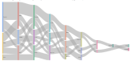

```{r setup, include=FALSE}
library(pander)
library(EndoMineR)
knitr::opts_chunk$set(echo = TRUE)

```

```{r global_options, include=FALSE}
knitr::opts_chunk$set( warning=FALSE, message=FALSE)
```


The analysis functions are split according to the cornerstone questions in day to day gastroenterological practice. These cornerstone questions are expanded upon in the Principles section. In brief they include Surveillance and patient tracking, Endoscopic and Pathology quality and patient flow questions. 

##Surveillance functions

Surveillance relates to the timing of a test relative to other tests or all tests done for a patient. As such the functions for surveillance extract the date the first test was done, as well as the last test and the difference in timing between each test, always grouped by patient. As all these functions are simply looking at the date of the test they can take a raw dataset, as long as a date column is present and use that, rather than have a lot of pre-processing steps. How the data is organised is explained in the Principles section but essentially the details of this are all hidden in the function.

<br>

```{r fig.width=12, fig.height=8,fig.align='center',echo=FALSE}
knitr::include_graphics("img/EndoMineR_Surveillance.svg")
```

<br>

The basic surveillance functions are simple but are the most often used. SurveilTimeByRow will extract the time difference between each individual endoscopy for an individual patient. This is useful to see how adherent the surveillance endoscopy is to guidelines. SurveilLastToNow will show the time difference between now and the last endoscope the patient had. This can be useful to determine if a patient is overdue a further endoscopy.
SurveilLastTest simply extracts the last and first test respectively for each patient. 

```{r exampleSurveillanceTimeByRow, eval = TRUE}
em1<-SurveilTimeByRow(Myendo,'HospitalNumber','Dateofprocedure')
pander(head(data.frame(em1[2],em1[ncol(em1)]),5))
em3<-SurveilLastTest(Myendo,'HospitalNumber','Dateofprocedure')
pander(head(data.frame(em3[2],em3[5]),5))
em4<-SurveilFirstTest(Myendo,'HospitalNumber','Dateofprocedure')
pander(head(data.frame(em4[2],em4[5]),5))
```

Of course we also want to know how many tests have been done over a time period and this is provided by two functions

```{r exampleSurveillanceCapacity}
em5<-SurveilCapacity(Myendo,"Dateofprocedure")

```

```{r exampleSurveillanceCapacity2,echo=FALSE}
pander::panderOptions('table.split.table', Inf)
pander(head(em5))
```


This function will return the number of tests by month. The more detailed function is:

```{r exampleHowManyTests}
how<-HowManyTests(Myendo,'Indications','Dateofprocedure','Surv')
```


This will provide the number of tests by month and year as a table as well as a ggplot. It returns a list containing both the ggplot and a dataframe so this can be accessed with how[1] and how[2]

##Patient flow functions

###Sankey plots
We often like to get an overview of how patients are flowing through a system overall. This can give a nice visual representation of whether which patients diverge from the normal flow through a system so we can study them further. There are two ways to look at this. Sankey plots give good timepoint by timepoint representation of flow. This really works with more than one type of event at each timepoint. 
For example, if we have a dataset with events such as 'radiofrequency ablation' and 'endoscopic mucosal resection' or 'nothing' we can use the Sankey plot to determine the order of events over a large patient population. You choose the column in the dataframe that describes the Procedure type ("EMR","RFA","nothing" in this case)


```{r exampleSurveySankey, eval = FALSE}
how<-SurveySankey(Myendo,"ProcedurePerformed")
```

<br>


```{r fig.width=12, fig.height=8,fig.align='center',echo=FALSE,out.width = "100%"}

```

<br>


###Circos plots

We may need something even more aggregated. Perhaps we want to see the overall number of patients that go from one event to another regardless of which timepoint it is at. To do this we can use a circos plot, which makes use of the circlize library, as follows:

```{r examplePatientFlow_CircosPlots, eval = FALSE}
flow<-PatientFlow_CircosPlots(v,"Date.y","pHospitalNum","ProcedurePerformed")
```

<br>


```{r fig.width=12, fig.height=8,fig.align='center',echo=FALSE,out.width = "60%"}
knitr::include_graphics("img/EndoMineR_Circos.svg")
```

<br>

##Assessment of quality functions

Quality is measured in a variety of ways. For endoscopy it is measured according to the adherence to a) standards for endoscopic documentation as well as b) detection of certain pathological conditions such as dysplasia (best summarised as lesion recognition)


###Documentation Quality
As regards adherence to documentation for example, a generic function is provided that will look up the presence of words presented in a list in a target column. It will then output the proportion of reports that have these words, as well as a barchart to show what proportion of the endoscopies showed these words. The list can be comprised of terms that should be mentioned in a report.

**_Input_**
                      
```{r exampleListLookup, eval = TRUE,echo=FALSE}
pander::panderOptions('table.split.table', Inf)
pander(head(data.frame(Myendo[2:3],Myendo[13])))
```

<br>

In this example we are looking for the words Barrett's and coeliac as perhaps we have chosen the macroscopic recognition of these features to denote what an endoscopist should always describe in the endoscope report

```{r exampleListLookup2, eval = TRUE}
myNotableWords <- c("arrett", "oeliac")
tt<-ListLookup(Myendo,'Findings',myNotableWords)
```

```{r exampleListLookup3, echo=FALSE}
pander::panderOptions('table.split.table', Inf)
pander(head(tt))
```

<br>

So we can see that the terms are present in the minority of reports across endoscopists, so perhaps we can look into this further..

<br>

###Endoscopic Quality

####Sedation Usage
Another measure of quality is the assessment of those factors that are recorded at endoscopy such as degree of sedation used etc. Rather than provide a function for each metric, again a generic function is provided that uses any quantifiable metric and plots it against the endoscopist. This function returns a list with two elements- the plot and the table:

```{r exampleEndoscChopperMeds}
Myendo<-EndoscMeds(Myendo,'Medications')
pander(head(data.frame(Myendo$HospitalNumber,Myendo$Fent,Myendo$Midaz),10))
MetricByEndoscopist(Myendo,'Endoscopist','Fent')
```


<br>


<br>

###Pathology Detection Quality

####Polyp and sample location

<br>


Although not strictly a measure of endoscopic quality, the location of polyps (as well as any sample location) can also be determined. This is particularly for lower GI endoscopy and can help determine whether, for example, the number of right sided polyps is lower than it should be for certain endoscopists.

To do this firstly the free text needs to be standardised. This is provided through the function TermStandardLocation which provides a standard correction for a number of typos and alternative spellings in histology. This also attempts to extract the sample location into a separate column

```{r exampleTermStandardLocation}
f<-DictionaryLookup(Mypath$Histology,LocationList())

#Just some column selection
fgg<-data.frame(f[(ncol(f)-1)],f[(ncol(f))])
pander(head(fgg,10))
```

Once this is done, a column called SampleLocation is appended to the existing dataset. This will attempt to state the location of all samples whether they are resections/ biopsies or polyps. If polyps specifically need to be located then the PolypLocator function can be used (after the TermStandardLocation function).

```{r examplePolypTidyUpLocator}
#fgg<-PolypLocator(fgg,'AllSampleLocator') 

#Just some column selection
#fg<-data.frame(fgg[(ncol(fgg)-2)],fgg[(ncol(fgg)-1)],fgg[(ncol(fgg))])
#pander(head(fg,3))
```


A further difficult area is the assessment of endoscopic quality by looking at the pathology processed from an endoscopy. This package is excellent at dealing with this kind of question because of its ability to merge the datasets together:

A particularly well developed area to look at is that of the Global Rating Scale for assessing the quality of colonoscopy. One of the metrics- the adenoma detection rate assesses the number of colonoscopies where at least one adenoma was detected.

One function is provided to produce a table that gives the number of adenomas, adenocarcinomas and hyperplastic polyps (also as a ration to adenomas) by endoscopist therefore immediately fulfilling the GRS requirement for the ADR as well as providing further metrics alongside


####Adenoma Detection Rates

```{r exampleGRS_Type_Assess_By_Unit, echo = TRUE,message=FALSE}
#Import the endoscopy and pathology datasets for colonoscopy
 MypathColon<-PathDataFrameFinalColon
 MyendoColon <- ColonFinal
 #Rename the columns so that numbers do not lead the column titles
 MyendoColon$OGDReportWhole <-gsub("2nd Endoscopist:","Second endoscopist:",
 MyendoColon$OGDReportWhole)
 #Extract the columns needed from endoscopy
 EndoscTree <-c("Hospital Number:","Patient Name:","General Practitioner:",
        "Date of procedure:","Endoscopist:","Second endoscopist:","Medications",
        "Instrument","Extent of Exam:","Indications:","Procedure Performed:",
        "Findings:","Endoscopic Diagnosis:")
 MyendoColon<-Extractor(MyendoColon,"OGDReportWhole",EndoscTree)
 #Extract the columns needed from Histology
 Histoltree <-c(
     "Hospital Number:","Patient Name:","DOB:","General Practitioner:",
     "Date received:","Clinical Details","Nature of specimen","Macroscopic description:","Histology",
     "Diagnosis")
#Tidy up to allow merge
 MypathColon <-Extractor(MypathColon,"PathReportWhole",Histoltree)
 names(MypathColon)[names(MypathColon) == 'Datereceived'] <- 'Dateofprocedure'
 MypathColon$Dateofprocedure <- as.Date(MypathColon$Dateofprocedure)
 #Do the merge
 vColon <-Endomerge2(MypathColon, "Dateofprocedure","HospitalNumber",
                     MyendoColon, "Dateofprocedure","HospitalNumber")

 
 #Use the function
GRSTable<-GRS_Type_Assess_By_Unit(vColon,'ProcedurePerformed','Endoscopist','Diagnosis','Histology')

```

```{r exampleGRS_Type_Assess_By_Unit1, echo = FALSE,message=FALSE}
pander::panderOptions('table.split.table', Inf)
pander(GRSTable)
```

