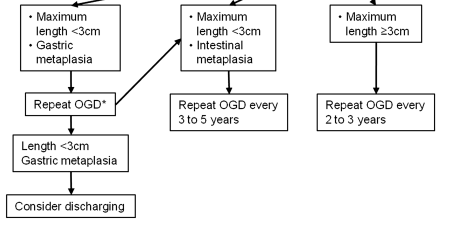

```{r setup, include=FALSE}
knitr::opts_chunk$set(echo = TRUE,message=FALSE, warning=FALSE)
library(knitr)
library(EndoMineR)
library(pander)
library(prettydoc)
```

```{r global_options, include=FALSE}
knitr::opts_chunk$set(echo=FALSE, warning=FALSE, message=FALSE)
```
##Specific diseases - Barrett's oesophagus

The functions above really act as building blocks for the further, more complex analyses we can do for specific Endoscopic-pathological disease sets

One particular disease is the premalignant oesophageal condition Barrett's oesophagus. This is characterised by the growth of cells (called columnar lined epithelium) in the oesophagus. These cells usually occupy the lower part of the oesophagus as a continuous sheet from the top of the stomach to varying lengths up the oesophagus. This condition requires endoscopic surveillance and the timing of this depends on the prior endoscopic features (namely the length of the Barretts segment as measured by the Prague score- explained below) and the pathological stage at that endoscopy (which for non-dysplastic samples, since the revised 2013 UK guidelines, means the presence or absence of intestinal metaplasia). This can be seen in the image below (from Fitzgerald RC, et al. Gut 2013;0:1–36. doi:10.1136/gutjnl-2013-305372)

<br>

```{r fig.width=12, fig.height=8,fig.align='center',echo=FALSE}

```

<br>

##Pre-processing Barrett's samples

Such a dataset needs some processing prior to the analysis so for this we can turn to a specific set of function for Barrett's oesophagus itself. 

<br>


###Prague score

Firstly we need to extract the length of the Barrett’s segment. This is known as the Prague score and is made up of the length from the top of the gastric folds (just below the gastro-oesophageal junction) to the top of the circumferential extent of the Barrett's segment (C). In addition the maximal extent is from the top of the gastric folds to the top of the tongues of Barrett's segment (M). This gives an overall score such as C1M2.


After filtering for endoscopic indication (eg “Surveillance-Barrett’s”- this is stored in the 'Indication' column in our data set) the aim of the following function is to extract a C and M stage (Prague score) for Barrett’s samples. This is done using a regular expression where C and M stages are explicitly mentioned in the free text. Specifically it extracts the Prague score. This is usually mentoned in the 'Findings' column in our dataset but obviously the user can define which column should be searched.

```{r exampleBarretts_PragueScore,echo = TRUE,message=FALSE, warning=FALSE}
v<-Barretts_PragueScore(Myendo,'Findings')

```
```{r exampleBarretts_PragueScore2,echo = FALSE,message=FALSE, warning=FALSE}

panderOptions('table.split.table', Inf)
pander(v[23:27,(ncol(v)-4):ncol(v)])
```

###Worst pathological stage

We also need to extract the worst pathological stage for a sample, and if non-dysplastic, determine whether the sample has intestinal metaplasia or not. This is done using 'degradation' so that it will look for the worst overall grade in the histology specimen and if not found it will look for the next worst and so on. It looks per report not per biopsy (it is more common for histopathology reports to contain the worst overall grade rather than individual biopsy grades). Specfically it extracts the histopathology worst grade. It should be run only once HistolDx is run (as this removed negative sentences) and it should be run on the column derived from HistolDx called Dx_Simplified


```{r exampleBarretts_PathStage, echo = TRUE,message=FALSE, warning=FALSE}

# The histology is then merged with the Endoscopy dataset. The merge occurs
# according to date and Hospital number
b<-Endomerge2(Myendo,'Dateofprocedure','HospitalNumber',Mypath,'Dateofprocedure',
'HospitalNumber')

#Picking out only the Barrett's related endoscopies
b<-b[grepl("Surv",b$Indications),]


b<-HistolDx(b,'Histology')
b<-Barretts_PathStage(b,'Dx_Simplified')

```

```{r exampleBarretts_PathStage2, echo = TRUE,message=FALSE, warning=FALSE,echo=FALSE}

panderOptions('table.split.table', Inf)
pander(b[20:23,(ncol(b)-4):ncol(b)])
```

###Therapeutic events

We also need to process any endoscopies where an event other than surveillance happened (unless filtered specifically for surveillance). This function extracts the Event- usually a therapeutic event, from the text eg endoscopic mucosal resection, radiofrequency ablation etc. It does not currently include stricture dilatation.  At the moment the event is extracted from the endoscopy only but for specimen extraction eg endoscopic mucosal resection future iterations may also examine the pathology data as it is likely to describe the presence of EMR more robustly. 

<br>


```{r exampleBarretts_EventType, echo = TRUE,message=FALSE, warning=FALSE}
v<-Endomerge2(Myendo,"Dateofprocedure","HospitalNumber",Mypath,"Dateofprocedure","HospitalNumber")

#Pick out the therapeutic procedures:
b<-v[grepl("Therap",v$Indications),]
b<-Barretts_EventType(b,'Histology', 'ProcedurePerformed','OGDReportWhole','Findings')

```

```{r exampleBarretts_EventType2, echo = TRUE,message=FALSE, warning=FALSE,echo=FALSE}
pander(b[23:27,(ncol(b)-4):ncol(b)])
```


So far we have extracted the worst pathological stage per sample as well as the length of the Barrett's segment where available. We have also extracted any therapeutic events that have occurred. These separate columns are the building blocks for further analyses.

<br>

###Follow-up groups

Having done these pre-processing steps, the follow-up group to which the last endoscopy belongs (rather than the patient as their biopsy results or Barrett's segment length and therefore their follow-up timing, may fluctuate over time) can be determined. The follow-up timing, as eplained in the the original guideline flowchart above, depends on the length of the Barrett's segment and the presence of intestinal metaplasia (a type of columnar lined epithelium). If abnormal cells (dysplasia) are present the there is a different follow-up regime which we won't concern ourselves with at the moment. The timing of follow-up is done with the function Barretts_FUType. This relies on the previous functions called Barretts_PathStage and Barretts_EventType and Barretts_PragueScore having been run. The Barretts_FUType function will tell you which follow up Rule the patient should be on so that the timing of the next endoscopy can be determined.

<br>

```{r exampleBarretts_FUType, echo = TRUE,message=FALSE, warning=FALSE}
v<-Endomerge2(Myendo,"Dateofprocedure","HospitalNumber",Mypath,"Dateofprocedure","HospitalNumber")
b<-Barretts_PathStage(v,'Histology')
b1<-Barretts_PragueScore(b,'Findings')
b2<-Barretts_EventType(b1,'Histology','ProcedurePerformed','OGDReportWhole','Findings')
b3<-Barretts_FUType(b2,'Findings')

```


```{r exampleBarretts_FUType2, echo = FALSE,message=FALSE, warning=FALSE,echo=FALSE}

panderOptions('table.split.table', Inf)
pander(b3[23:27,(ncol(b3)-4):ncol(b3)])
```

###Running all the Barrett's functions:

It is sometimes useful to run all the Barrett's functions rather than one by one.
This is provided by the function BarrettsAll which is a parent function for
Barretts_PathStage, Barretts_EventType, Barretts_FUType. It relies on the columns being named in a standardised way but not all the columns need to be present- if they are not present the BarrettsAll function will just skip them.


```{r exampleBarrettsAll, echo = TRUE,message=FALSE, warning=FALSE}

 # The histology is then merged with the Endoscopy dataset. The merge occurs
 # according to date and Hospital number
 v<-Endomerge2(Myendo,'Dateofprocedure','HospitalNumber',Mypath,'Dateofprocedure',
 'HospitalNumber')
 #The function relies on the other Barrett's functions being run as well:
 b3<-BarrettsAll(v)

```

```{r exampleBarrettsAll1, echo = FALSE,message=FALSE, warning=FALSE}
 panderOptions('table.split.table', Inf)
 pander(b3[23:27,(ncol(b3)-4):ncol(b3)])
```


## Assessment of Barrett's therapeutics

Barrett's patients also undergo therapeutic procedures and there are various metrics to analyse the performance of the therapy by endoscopist, as well which catheters are being used etc. To start with we can do simple things like plotting all the pathological grades of the EMRs.This should only be run after all the Barretts functions (as explained above- all contained within BarrettsAll) so that the column event is present in the dataframe.

The therapeutic functions are fairly self-explanatory. The function to determine the post EMR grade is BarrettsEMRGrades with correlation with the endoscopists Paris classification (a standardised method to describe lesions in the upper GI tract) provided for with the function. Using the dataset extracted from the code chunk above:
 

```{r exampleBarretts_LesionRecognitionEMR2, echo = TRUE,fig.width=7,fig.height=5,message=FALSE, warning=FALSE} 
# As long as the code int he chunk above has been run then all that needs to be done is:
BarrettsEMRGrades(b3)
``` 


<br>

 In order to determine the basic number of EMR, RFA and APC a function called BarrettsBasicNumbers is provided which outputs a geom_line plot with the information on it.
 
```{r exampleBarrettsBasicNumbers, echo = TRUE,message=FALSE, warning=FALSE} 
BarrettsBasicNumbers(b3,"Date.x")
``` 

<br>


 To assess the number of different catheter types used (for renumeration purposes for example) the following function BarrettssRFACath can be used. Because the use of a catheter may be part of the ProcedurePerformed column or in the free text of Findings, more than one column can be searched in.
 
```{r exampleBarrettsTherapeuticsRFA_ByCatheter,echo = TRUE,fig.width=7,fig.height=5,message=FALSE, warning=FALSE}
BarrettssRFACath(b3,"ProcedurePerformed","Findings")
``` 

<br>

One of the most important aspects of therapeutics is the assessment of outcome which is defined as clearance of intestinal metaplasia (CRIM), usually on at least two endoscopies. As most patients undergoing Barrett's ablation will require radiofrequency ablation after the initial endoscopic mucosal resection, we can define CRIM as being an endoscopy where the therapeutic procedure is listed as 'nothing' in the EVENT column (this will only work if the Barrett's pre-processing functions have been used) after a course of RFA or EMR

```{r exampleBarrettsCRIM, echo = TRUE,message=FALSE, warning=FALSE} 
ds<-Barretts_CRIM(b3,'pHospitalNum',"EVENT")
ds2<-data.frame(ds$pHospitalNum,ds$ind)
``` 

```{r exampleBarrettsCRIM1, echo = FALSE,message=FALSE, warning=FALSE}
panderOptions('table.split.table', Inf)
pander(head(ds2,10))
``` 

<br>

##Quality assessment in Barrett's surveillance

###Quality of documentation for Barrett's surveillance endoscopies

We can also assess the documentation used in Barrett's endoscopies. Documentation quality is a cornerstone of endoscopic quality as listed in the EndoMineR principles and also in the [Analysis](https://sebastiz.github.io/EndoMineR/articles/Analysis.html) tutorial There are standards associated with the endoscopies that all endoscopists should adhere to. This function therefore assesses the Barrett's documentation. This notes how many reports contain the mandatory report fields as specified in the BSG standards on  Barrett's endoscopic reporting. This should be run after the Barretts_Prague as assessment of the Prague score is a part of this assessment:

```{r exampleBarrettsQuality_AnalysisDocumentation, echo = TRUE,message=FALSE, warning=FALSE}
BarrettsDocumentQual(b3,"Findings")
```


<br>


###Quality of perfomance of Barrett's surveillance endoscopies as just by tissue sampling

One of the essential requirements to demonstrate adequate sampling of Barrett's oesophagus during endoscopy is that the endoscopist should adhere to the 'Seattle protocol' for biopsies which is to take  4 equally spaced biopsies at 2cm intervals in the circumferential part of the oesophagus. Because the macroscopic description of the pathological specimen tells us how many samples are taken overall (and rarely how many at each level but this is usually not the case for a variety of reasons) we can determine the shortfall in the number of biopsies taken, per endoscopist. Again pre-processing the Barrett's samples is pre-requisite. The Number of biopsies and their size should also be extracted using the histopathology functions.

```{r exampleBarrettsQuality_AnalysisBiopsyNumber,echo = TRUE,fig.width=7,fig.height=5,message=FALSE, warning=FALSE}
 # The number of average number of biopsies is then calculated and
 # compared to the average Prague C score so that those who are taking
 # too few biopsies can be determined
b4<-HistolNumbOfBx(b3,'Macroscopicdescription','specimen')
b4<-HistolBxSize(b4,'Macroscopicdescription')
BarrettsBxQual(b4,'Date.x','HospitalNumber',
                                      'Endoscopist')
```
 
 <br>
 
 This function will again return a list with a ggplot showing the shortfall per endoscopist as well as a table with the same values.

###Quality of perfomance of Barrett's surveillance endoscopies

As we discovered with some of the generic functions above, one way to determine quality of endoscopy is to assess the pathology of specimens taken at surveillance per year. This function outputs a plot which determines the the overall number of pathologies (low/high grade dysplasia and cancer) for patients on surveillance.

```{r exampleBarrettsSurveillance_PathDetection,echo = TRUE,fig.width=7,fig.height=5,message=FALSE, warning=FALSE}
BarrettsPathDetectQual(b3,'Myplot')
```
 

<br>
 
 This function provides a plot with absolute numbers of pathology detected. This of course doesn't tell us the per endoscopist rate so a further function is provided which looks specifically at the detection of dysplasia by endoscopist as a function of the number of surveillance endoscopies done by that endoscopist. The output is provided as a table of proportions per endoscopist. This is called the dysplasia detection rate and gives you a good idea of how robustly an endoscopist is examining a segment of Barrett's mucosa.

```{r exampleBarrettsSurveillanceDDR,echo = TRUE,fig.width=7,fig.height=5,message=FALSE, warning=FALSE}
bDDR<-BarrettsDDRQual(b3,'Endoscopist','IMorNoIM')
``` 

```{r exampleBarrettsSurveillanceDDR2,echo = TRUE,echo=FALSE,message=FALSE, warning=FALSE}
panderOptions('table.split.table', Inf)
pander(head(bDDR,10))

``` 


##Surveillance enrollment and lost to follow-ups


###Enrollment rates to surveillance programme

We can determine how many patients who underwent endoscopy for reasons that was not Barrett's surveillance, and in whom Barrett's oesophagus was found, have had further follow-up endoscopies ie what the enrollment to surveillance rate is in those who weren't known to have Barrett's when their endoscopy was performed.

This function graphs the patients who were not on surveillance programmes and sees how many then had an endoscopy. This should be run after the Barretts_Prague and Barretts_PathStage.

```{r exampleBarrettsPatientTracking_Enrollment_Surveillance, echo = TRUE}
Enroll<-BarrettsSurveil(Myendo,'HospitalNumber','Dateofprocedure','Indications')
MyEnroll<-data.frame(Enroll["HospitalNumber"],Enroll["Years"])
```


```{r exampleBarrettsPatientTracking_Enrollment_Surveillance1, echo = FALSE}
pander(MyEnroll)

```


###Patients undergoing surveillance

Perhaps we are also interested in how many patients fall under each follow-up category so we can plan how many Barrett's surveillance endoscopies we are going to have to do over a certain time period The function to do this gets the unique patient ID's for each patient, for each rule. It lists the unique PatientIDs associated with a rule ('Rule1','Rule2','Rule3','NoRules'). This allows us to determine how many patients will need follow up at specific time intervals. This should be run after the Barretts_Prague, Barretts_PathStage and Barretts_FUType. The following example shows the inidividual patients who are currently under a Rule1 follow up.

```{r exampleBarrettsPatientTracking_UniqueHospNum, echo = TRUE}
v<-Endomerge2(Myendo,"Dateofprocedure","HospitalNumber",Mypath,"Dateofprocedure","HospitalNumber")
b4<-BarrettsAll(v)
colnames(b4)[colnames(b4) == 'pHospitalNum'] <- 'HospitalNumber'
Rule<-BarrettsSurveil_HospNum(b4,'Rule1','HospitalNumber')
```


```{r exampleBarrettsPatientTracking_UniqueHospNum1, echo = FALSE}
pander(head(Rule,10))


```

