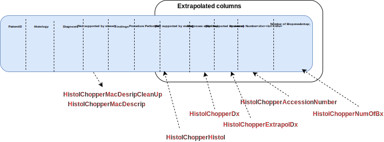

## Aims of EndoMineR

The goal of EndoMineR is to extract as much information as possible from endoscopy reports and their associated pathology specimens. 

Gastroenterology now has many standards against which practice is measured although many reporting systems do not include the reporting capability to give anything more than basic analysis. Much of the data is locked in semi-structured text. However the nature of semi-structured text means that data can be extracted in a standardised way- it just requires more manipulation. This package provides that manipulation so that complex endoscopic-pathological analyses, in line with recognised standards for these analyses, can be done.


##How is the package divided?


{width=900px}

The package is basically in three parts. How all the functions are connected in Figure 2. Extracts from this figure will be used in sequential sections below.

1. **The extraction**- This is really when the data is provided as full text reports. You may already have the data in a spreadsheet in which case this part isn't necessary

2. **Cleaning**- These are a group of functions that allow the user to extract and clean data commonly found in endoscopic and pathology reports. The cleaning functions usually remove common typos or extraneous information and do some reformatting

3. **Analyses**- The analyses provide graphing function as well as analyses according to the cornerstone questions in gastroenterology- namely surveillance, patient tracking, quality of endoscopy and pathology reporting and diagnostic yield questions.


## The extractor function

Endoscopic and pathological data will come in one of two forms- either as a collection of the whole text report or as spreadsheets with some degree of separation into different columns of the various aspects of that report eg who the Endoscopist was, the patient's unique identifier etc.
For the latter, the package user will not need to Extract information as it is already extracted and so can go straight to cleaning the data. For the former the Extractor function has been provided:

<br>


<br>

One of the most useful functions in the package is the Extractor. Different hospitals will use different software with different headings for endoscopic reports. The extractor allows the user to define the separations in a report so that all reports can be automatically placed into a meaningful dataframe for further cleaning. This is analogous to tokenization in natural language processing. Here we use the in built datasets as part of the package. Prior to tokenization it is recommended to use the ChopperNewLine function to divide the free text up by sentence (this can be useful if not using multiline regex or you have another way of splitting the text rather than using the Extractor)

```{r exampleChopperNewLines, eval = FALSE}
v<-ChopperNewLines(Myendo,'OGDReportWhole')
```

<br>

A list of keywords is then constructed. This list is made up of the words that will be used to split the document. The Extractor then does the splitting for each pair of words, with some cleaning up and then returns the split dataframe:

```{r exampleExtractor, eval = FALSE}
Mypath<-data(PathDataFrameFinalColon)
HistolTree<-list("Hospital Number","Patient Name","DOB:","General Practitioner:",
"Date of procedure:","Clinical Details:","Macroscopic description:","Histology:","Diagnosis:","")
for(i in 1:(length(HistolTree)-1)) {
Mypath<-Extractor(Mypath,"PathReportWhole",as.character(HistolTree[i]),
as.character(HistolTree[i+1]),as.character(HistolTree[i]))
}
```


## The cleaning functions

### Endoscopic cleaning

Once the extraction has been done there are various cleaning functions provided based around the extraction of likely columns. For example if the Endoscopist name has been pulled out, the EndoscChopperEndoscopist function can be used which returns the submitted data frame with the Endoscopist column cleaned up
```{r exampleEndoscChopperEndoscopist, eval = FALSE}
EndoscChopperEndoscopist(Myendo,'Endoscopist')
```

This function performs the cleaning of common things found in the text that may cause confusion. 

<br>


<br>

The EndoscChopperMeds currently extracts Fentanyl and Midazolam doses into a separate column and reformats them as numeric columns so further calculations can be done. In future iterations pethidine, propofol and general anaesthetic will also be able to be extracted. 

Several other similar clean up functions are available for Endoscopy as follows:
```{r exampleEndoCleaningFunc, eval = FALSE}
v<-EndoscChopperMeds(Myendo,'Medications')
v<-EndoscChopperInstrument(Myendo,'Instrument')
v<-EndoscChopperIndications(Myendo,'Indications')
v<-EndoscChopperProcPerformed(Myendo,'ProcedurePerformed')
```

Future iterations will try to make these cleaning functions more generic and applicable to a wider number of use cases

### Histological cleaning

The cleaning functions for histology are a little more difficult as Histology reports often have a greater degree of free text reporting.
In general, each histology reports can be divided into the Macroscopic description of a specimen which itself is comprised of how many specimens there are for each sample sent (a sample can be a pot which includes several specimens) and how big each specimen is. The report will often give a detailed description of what is actually seen and then provide an overall diagnosis.

<br>



<br>


The histology cleaning functions are based around this. For example, the HistolChopperHistol cleans the Histology text if present. In addition it removes Negative diagnoses using the Negativeremove function. This function is designed to remove all sentences that give negative diagnoses (eg "There is no evidence of...") so that false positive diagnoses are not made during the analysis stage.

This NegativeRemove function has also been applied to the HistolChopperDx

```{r exampleEHistolChopperHistol, eval = FALSE}
t<-HistolChopperHistol(Mypath,'Histology')
```

Because the information from the Macroscopic Description is based around numbers, a further function has been provided to extract numbers from the text. This function is usually only used as part of HistolChopperNumOfBx which extracts the number of biopsies taken.


In order to extract the numbers, the limit of what has to be extracted has to be set as part of the regex so that the function takes whatever word limits the selection.It collects everything from the regex [0-9]{1,2}.{0,3} to whatever the string boundary is.

```{r exampleHistolChopperNumbOfBx, eval = FALSE}
v<-HistolChopperNumbOfBx(Mypath,'Macroscopicdescription','specimen')
```

Other less useful functions include:

1. HistolChopperAccessionNumber which extracts Accession Number  data from the report where one is present.The Accession number relates to the actual specimen number as ascribed by the pathology service.

2. HistolChopperExtrapolDx which extracts other specific diagnoses from the report. These have been hard coded to 
look for dysplasia cancer and GIST. 

3. HistolChopperMacDescripCleanup. This extracts Macroscopic description data from the pathology report.Macroscopic description usually relates to the number of specimens retrieved, the size of each specimen and the location it was taken from. The cleanup usually relates to the removal of top and tail characters such as who reported the specimens etc. 

These are all called in the same way:

```{r exampleOtherFunctionsHistology, eval = FALSE}
v<-HistolChopperMacDescripCleanup(Mypath,"Macroscopicdescription")
v<-HistolChopperExtrapolDx(Mypath,"Diagnosis")
v<-HistolChopperAccessionNumber(Mypath,"Histology","SP-\\d{2}-\\d{7}")
```
v<-HistolChopperMacDescripCleanup(Mypath,"Macroscopicdescription")

<br>
<br>


