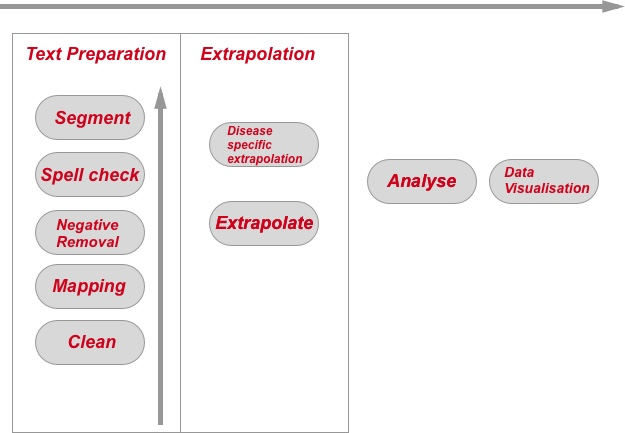
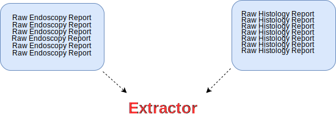

```{r setup, include=FALSE}
library(pander)
library(EndoMineR)
knitr::opts_chunk$set(echo = TRUE)
```

```{r global_options, include=FALSE}
knitr::opts_chunk$set(echo=FALSE, warning=FALSE, message=FALSE)
```
## **Aims of EndoMineR**

The goal of EndoMineR is to extract as much information as possible from free or semi-structured endoscopy reports and their associated pathology specimens. 

Gastroenterology now has many standards against which practice is measured although many reporting systems do not include the reporting capability to give anything more than basic analysis. Much of the data is locked in semi-structured text. However the nature of semi-structured text means that data can be extracted in a standardised way- it just requires more manipulation. This package provides that manipulation so that complex endoscopic-pathological analyses, in line with recognised standards for these analyses, can be done.


##**How is the package divided?**

<br>

```{r fig.width=8, fig.height=8,fig.align='center',out.width = "50%",echo=FALSE}

```


The package is basically divied into three parts. How all the functions are connected in shown in the adjoining figure. 
The import of the raw data is left up to the user with the overall aim being that all the data is present in one dataframe. 


## **1. Extraction and cleaning**
If using raw reports, then once you have imported the data into your R environment, you can go ahead and use the **textPrep** function. If you have pre-segregated data, tehn use the EndoPaste function. This basically reformats your data so that everything is merged back into a raw text file, but it keeps the column headers as delimiters for use later. This is shown in the figure below:


Once the data is ready you can use the textPrep function. This function is really a wrapper for a number of different functions that work on your data. 

a. **Dusting the data** Firstly the data is cleaned up so that extra newlines, spaces, unnecessary punctuation etc is dealt with. Although you dont need to know the details of this, if you want to look under the hood you can see that this is part of the ColumnCleanUp function.

b. **Spell checking** The textPrep also implements a spell checker (the **spellCheck** function). This really checks the spelling of gastroenterology terms that are present in the in-built lexcicons. So if for example the report contains the terms 'Radiafrequency ablashion' then this will be corrected using Radiofrequency ablation. This is one function that acts to standardise the text in the report so that downstream analyses can be robust. 

c. **Negative phrase removal** The text is then passed along to the **NegativeRemove** function. This will remove any phrases that contain negative sentences indicating a non-positive finding. For example it would remove 'There is no evidence of dysplasia here'. This makes text extraction analyses, which often report the detection of a positive finding, much more accurate. If you wish to include these types of phrases however, you can. This function is part of the parameters you can switch on and off for the textPrep function.

d. **Term mapping** The next step is to perform term mapping. This means that variations of a term are all mapped to a single common term. For example 'RFA' and 'HALO' may be both mapped to 'Radiofrequency ablation'. This is performed using the using the **DictionaryInPlaceReplace** function. This function looks through all of the lexicons included in this package to perform this. The lexicons are all manually created and consist of key-value pairs which therefore map a key 9which is the term variant) to a value (which is the standardised term that should be used).

e. **Segregating the data** Finally the text is ready to separate into columns. The basic **Extractor** function will take your data and the list of terms you have supplied that act as the column boundaries, the separate your data accordingly. There are a couple of options here. If you think the headers for your text vary a little bit, then you can change the parameter in the textPrep function to use an alternatiuve Extractor, called **Extractor2** that can deal with this. It can be worth experimenting with your data to find out which is the better segregator.


The Extractor (or Extractor2) is a very useful function. Different hospitals will use different software with different headings for endoscopic reports. The Extractor allows the user to define the separations in a report so that all reports can be automatically placed into a meaningful dataframe for further cleaning. Here we use the in-built datasets as part of the package. 

<br>

A list of keywords is then constructed. This list is made up of the words that will be used to split the document. It is very common for individual departments in both gastroenterology and pathology to use semi-structured reporting so that the same headers are used between patient reports. The list is therefore populated with these headers as defined by the user. The Extractor then does the splitting for each pair of words, dumps the text between the delimiter in a new column and names that column with the first keyword in the pair with some cleaning up and then returns the new dataframe. 


<br>
```{r fig.width=12, fig.height=8,fig.align='center',echo=FALSE}

```


Here we use an example dataset (which has not had separate columns selected already) as the input:

```{r exampleExtractor,echo=FALSE}
PathDataFrameFinalColon2<-PathDataFrameFinalColon
names(PathDataFrameFinalColon2)<-"PathReportWhole"
pander(head(PathDataFrameFinalColon2,1))
```


<br>

We can then define the list of delimiters that will split this text into separate columns, title the columns according to the delimiters and return a dataframe. each column simply contains the text between the delimiters that the user has defined. These columns are then ready for the more refined cleaning provided by subesquent functions.

<br>


```{r exampleExtractor2,echo=TRUE}
library(EndoMineR)
mywords<-c("Hospital Number","Patient Name:","DOB:","General Practitioner:",
"Date received:","Clinical Details:","Macroscopic description:",
"Histology:","Diagnosis:")

PathDataFrameFinalColon3<-Extractor(PathDataFrameFinalColon2$PathReportWhole,mywords)

```

```{r exampleExtractor3,echo=FALSE}
#PathDataFrameFinalColon3<-head(PathDataFrameFinalColon3[2:10],1)
pander::panderOptions('table.split.table', Inf)
pander(head(PathDataFrameFinalColon2,1))
```

The Extractor function is embedded within textPrep so you may never have to use it directly, but you will always have to submit a list of delimiters so that textPrep can use the Extractor to do its segregation. 

If your original data was already segregated, then use the **EndoPaste** function first. This will merge your columns back together so that the textPrep function can do all the cleaning. The EndoPaste function will output both the merged text as well as a list of delimiters (which have been taken from the column names). This should be used as the delimiter list when you use the textPrep function.

If you wish, further cleaning functions are provided to get clean the Endoscopist name (**EndoscEndoscopist**). This will basically get rid of titles and make sure that names are properly formatted which is important for per Endoscopist analyses.


## **2. Data linkage**

Endoscopy data may be linked with other types of data. The most common associated dataset is pathology data from biopsies etc taken at endoscopy. This pathology data should be processed in exactly the same way as the endoscopy data- namely with textPrep (with or without EndoPaste). 

The resulting pathology dataset should then be merged with the endoscopy dataset using **Endomerge** which will merge all rows with the same hospital number and do a fuzzy match (up to 7 days after the endoscopy) with pathology so the right endoscopy event is associated with the right pathology report.An example of merging the included datasets Mypath and Myendo is given here:

```{r exampleEndomerge2,echo=FALSE}
v<-Endomerge2(Myendo,'Dateofprocedure','HospitalNumber',Mypath,'Dateofprocedure','HospitalNumber')
```

## **3. Deriving new data from what you have**

Once the text has been separated in to the columns of your choosing you are ready to see what we can extract. Functions are provided to allow quite complex extractions at both a general level and also for specific diseases.

a. **Generic functions to derive data**

The extraction of medication type and dose is important for lots of analyses in endoscopy. This is provided with the function **EndoscMeds**. The function will take the column that you specify and then output a dataframe. You will need to re-bind this output with the original dataframe for further analyses. This is shown below


The **EndoscopyEvent** function will extract any event that has been performed at the endoscopy and dump it in a new column. It does this by looking in pairs of sentences and therefore wraps around a more basic function called **EndoscopyPairs_TwoSentence**. This allows us to get the site that the event (usually a therapy) happened on. A example sentence might be 'There was a bleeding gastric ulcer. A clip was applied to it' We can only extract stomach:clip by reference to the two sentences.

There is also a lot of information we can extract into a separate column from the histopathology information.
We can derive the number of biopsies taken (usually specified in the macroscopic description of a sample) using the function **HistolNumbOfBx**. 
We can also find the average biopsy size using **HistolBxSize**.

**HistolTypeAndSite** which itself performs a similar pairing process to EndoscopyEvent (for various reasons it uses a slightly different function called **EndoscopyPairs_OneSentence**. so can give the specimen type (ie polyp or biopsy sample) and the place it was taken from. It is better to derive this kind of information from the histology report rather than the endoscopy report as it tends to be more rigorously described in endoscopy reports.

3. **Analyses**- The analyses provide graphing functions as well as analyses according to the cornerstone questions in gastroenterology- namely surveillance, patient tracking, quality of endoscopy and pathology reporting and diagnostic yield questions as explained in the EndoMineR principles pages. The analyses are separated into generic analyses that are relevant to any endo-pathological dataset, as well as specific analyses for adenoma detection rates and Barrett's surveillance and therapy. Further disease specific datasets will be included in future iterations.


## **Endoscopic cleaning**

There will always be a certain amount of data cleaning that only the end user can do before data can be extracted. There is some cleaning that is common to many endoscopy reports and so functions have been provided for this. An abvious function is the cleaning of the endoscopist's name. This is done with the function **EndoscEndoscopist**. This removes titles and tidies up the names so that there aren't duplicate names (eg "Dr. Sebastian Zeki" and "Sebastian Zeki"). This is applied to any endoscopy column where the Endoscopist name has been isolated into its own column.

<br>

```{r exampleEndoscEndoscopist, echo = FALSE}
pander(head(Myendo[2:6],10))
```


```{r exampleEndoscEndoscopist2,echo = TRUE}
EndoscEndoscopist(Myendo$Endoscopist[2:6])
```

<br>

### **Medication cleaning**


The EndoscMeds currently extracts Fentanyl, Pethidine, Midazolam and Propofol doses into a separate column and reformats them as numeric columns so further calculations can be done. 

```{r exampleRawEndoExtract, echo = TRUE}
mywords<-c("Hospital:","Hospital Number:","Patient Name:","General Practitioner:","Date of #procedure:","Endoscopist:","Second Endoscopist","Medications:","Instrument:","Extent of Exam:","Indications:","Procedure Performed:","Findings:","Diagnosis:")
TheOGDReportFinal2<-Extractor(TheOGDReportFinal$OGDReportWhole,mywords)

```


```{r exampleEndoCleaningFuncMed, echo = TRUE}
MyendoMeds<-cbind(EndoscMeds(Myendo$Medications), Myendo)
pander(head(MyendoMeds[1:4],5))

```


### **Extraction of elements from the Macroscopic Description**

Because the information from the Macroscopic Description is based around numbers, a further function has been provided called **HistolNumOfBx** to extract the number of biopsies taken.


In order to extract the numbers, the limit of what has to be extracted has to be set as part of the regex so that the function takes whatever word limits the selection.It collects everything from the regex [0-9]{1,2}.{0,3} to whatever the string boundary is.
For example, if the report usually says:

<br>

```{r exampleHistolNumbOfBx1, echo = FALSE}
sg<-data.frame(Mypath$HospitalNumber,Mypath$PatientName,Mypath$Macroscopicdescription)
pander(head(sg,5))
```

<br>

Based on this, the word that limits the number you are interested in is 'specimen' so the function and it's output is:

<br>

```{r exampleHistolNumbOfBx2, echo = TRUE}
Mypath$NumbOfBx<-HistolNumbOfBx(Mypath$Macroscopicdescription,'specimen')
```

```{r exampleHistolNumbOfBx3, echo = FALSE}
sh<-data.frame(Mypath$HospitalNumber,Mypath$PatientName,Mypath$NumbOfBx)
pander(head(sh,5))
```


We might also be interested in the size of the biopsy taken. A further function called **HistolBxSize** is provided for this. This is also derived from the macroscopic description of the specimen

```{r exampleHistolBxSize1, echo = FALSE}
Mypath$BxSize<-HistolBxSize(Mypath$Macroscopicdescription)
sh<-data.frame(Mypath$HospitalNumber,Mypath$PatientName,Mypath$BxSize)
pander(head(sh,5))
```

A final function is also provided called **HistolTypeAndSite**. This is particularly useful when trying to find out which biopsies came from which site. 

The output is provided as a site:specimen type pair. An alternative output is also provided which groups locations (eg the gastro-oesophageal junction is seen as part of the oesophagus). 


