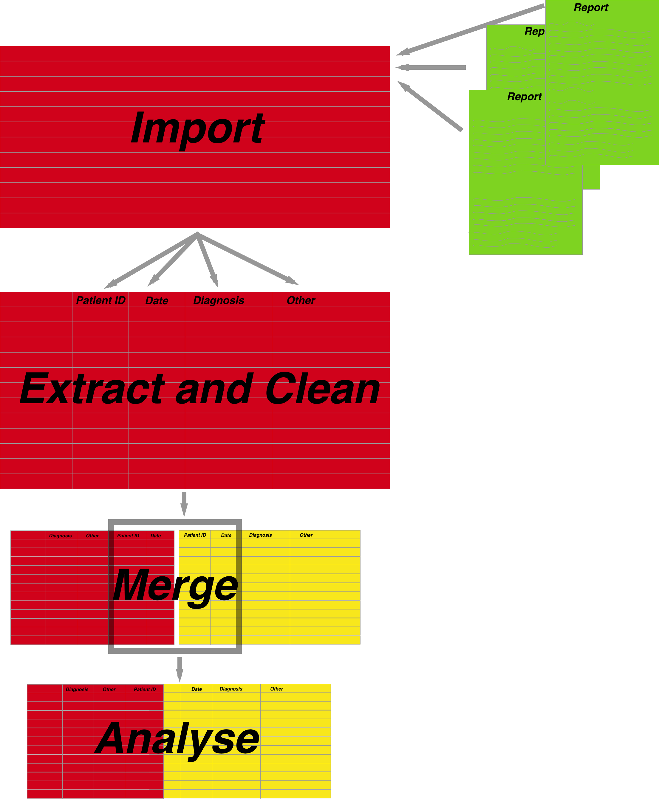
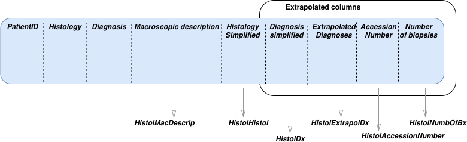

```{r setup, include=FALSE}
library(pander)
library(EndoMineR)
knitr::opts_chunk$set(echo = TRUE)
```

```{r global_options, include=FALSE}
knitr::opts_chunk$set(echo=FALSE, warning=FALSE, message=FALSE)
```
## Aims of EndoMineR

The goal of EndoMineR is to extract as much information as possible from free or semi-structured endoscopy reports and their associated pathology specimens. 

Gastroenterology now has many standards against which practice is measured although many reporting systems do not include the reporting capability to give anything more than basic analysis. Much of the data is locked in semi-structured text. However the nature of semi-structured text means that data can be extracted in a standardised way- it just requires more manipulation. This package provides that manipulation so that complex endoscopic-pathological analyses, in line with recognised standards for these analyses, can be done.


##How is the package divided?

<br>

```{r fig.width=8, fig.height=8,fig.align='center',out.width = "50%",echo=FALSE}

```


The package is basically divied into three parts. How all the functions are connected in shown in the adjoining figure. The import of the raw data is left up to the user with the overall aim being that all the data is present in one dataframe. The user can either load data so that each row of the data is an endoscopic episode (or a pathology report) in its raw form and then allow the package to extract the relevant parts of the data, or the data can be pre-extracted (ie separate columns for the Endoscopist, medication given etc.) so that the Extraction step is skipped. The package can take either but the importing is left to the user.

1. **The extraction**- This is really when the data is provided as full text reports. You may already have the data in a spreadsheet in which case this part isn't necessary. The extraction is provided as one function Extractor, explained below.

2. **Cleaning**- These are a group of functions that allow the user to extract and clean data commonly found in endoscopic and pathology reports. The cleaning functions usually remove common typos or extraneous information and do some reformatting. Some of the functions will also extract derived data into separate columns. The cleaning functions are provided on a per column basis (so if you have a column containing the endoscopist name, for example ,then EndoEndoscopist will clean this. However convenience functions are also provided to run the cleaning functions on several columns where present. EndoscAll for example will run several of the cleaning functions as long as the columns are properly named so that the subfunctions are run on the correct columns.

3. **Analyses**- The analyses provide graphing function as well as analyses according to the cornerstone questions in gastroenterology- namely surveillance, patient tracking, quality of endoscopy and pathology reporting and diagnostic yield questions as explained in the EndoMineR principles pages. The analyses are separated into generic analyses that are relevant to any endo-pathological dataset, as well as specific analyses for adenoma detection rates and Barrett's surveillance and therapy. Further disease specific datasets will be included in future iterations.


## The extractor function

Endoscopic and pathological data will come in one of two forms- either as a collection of the whole text report or as spreadsheets with some degree of separation into different columns of the various aspects of that report eg who the Endoscopist was, the patient's unique identifier etc.
For the latter, the package user will not need to Extract information as it is already extracted and so can go straight to cleaning the data. For the former the Extractor function has been provided:

<br>
```{r fig.width=12, fig.height=8,fig.align='center',echo=FALSE}
knitr::include_graphics("img/EndoMineR_Extractor.svg")
```

<br>

The Extractor is a very useful function. Different hospitals will use different software with different headings for endoscopic reports. The extractor allows the user to define the separations in a report so that all reports can be automatically placed into a meaningful dataframe for further cleaning. Here we use the in-built datasets as part of the package. Prior to using the function it is recommended to use the NewLine function to divide the free text up by sentence (this can be useful if not using multiline regex or you have another way of splitting the text rather than using the Extractor). However this is not absolutely necessary.

```{r exampleNewLines, eval = FALSE}
v<-NewLines(TheOGDReportFinal,'OGDReportWhole')
```

<br>

A list of keywords is then constructed. This list is made up of the words that will be used to split the document. It is very common for individual departments in both gastroenterology and pathology to use semi-structured reporting so that the same headers are used between patient reports. The list is therefore populated with these headers as defined by the user. The Extractor then does the splitting for each pair of words, dumps the text between the delimiter in a new column and names that column with the first keyword in the pair with some cleaning up and then returns the new dataframe. Here we use an example dataset:

```{r exampleExtractor,echo=FALSE}
PathDataFrameFinalColon2<-PathDataFrameFinalColon
names(PathDataFrameFinalColon2)<-"PathReportWhole"
pander(head(PathDataFrameFinalColon2,1))
```

```{r exampleExtractor2,echo=TRUE}
mywords<-c("Hospital Number","Patient Name:","DOB:","General Practitioner:",
"Date received:","Clinical Details:","Macroscopic description:",
"Histology:","Diagnosis:")
PathDataFrameFinalColon2<-Extractor(PathDataFrameFinalColon2,"PathReportWhole",mywords)

```

```{r exampleExtractor3,echo=FALSE}
PathDataFrameFinalColon2<-head(PathDataFrameFinalColon2[2:10],1)
pander::panderOptions('table.split.table', Inf)
pander(head(PathDataFrameFinalColon2,1))
```


## Endoscopic cleaning

Once the extraction has been done there are various cleaning functions provided based around the extraction of likely columns.This is illustrated in the figure below: 

<br>


```{r fig.width=12, fig.height=8,fig.align='center',echo=FALSE}
knitr::include_graphics("img/EndoMineR_EndoscopyClean.png")
```

<br>

### Endoscopist cleaning

For example if the Endoscopist name has been pulled out, the EndoscEndoscopist function can be used which returns the submitted data frame with the Endoscopist column cleaned up. 

<br>

The endoscopist column might initially look like this:

<br>

```{r exampleEndoscEndoscopist, echo = FALSE}
pander(head(Myendo[2:6],10))
```


```{r exampleEndoscEndoscopist2,echo = TRUE}
Myendo2<-EndoscEndoscopist(Myendo,'Endoscopist')
```

This function performs the cleaning of common things found in the text that may cause confusion such as getting rid of the titles ahead of the Endoscopist's name. The result is as follows:

<br>

```{r exampleEndoscEndoscopist3, echo = FALSE}
pander(head(Myendo2[2:6],10))
```

<br>

### Medication cleaning


The EndoscMeds currently extracts Fentanyl and Midazolam doses into a separate column and reformats them as numeric columns so further calculations can be done. In future iterations pethidine, propofol and general anaesthetic will also be able to be extracted. 

Several other similar clean up functions are available for Endoscopy as follows. We will extract from the Raw endoscopy data first:

```{r exampleRawEndoExtract, echo = TRUE}
mywords<-c("Hospital:","Hospital Number:","Patient Name:","General Practitioner:","Date of procedure:","Endoscopist:","Second Endoscopist",
           "Medications:","Instrument:","Extent of Exam:","Indications:","Procedure Performed:",
"Findings:","Diagnosis:")
TheOGDReportFinal2<-Extractor(TheOGDReportFinal,"OGDReportWhole",mywords)

```


```{r exampleEndoCleaningFuncMed, echo = TRUE}
TheOGDReportFinal2df<-data.frame(TheOGDReportFinal2["HospitalNumber"],TheOGDReportFinal2["Instrument"],TheOGDReportFinal2["Indications"],TheOGDReportFinal2["Medications"],TheOGDReportFinal2["ProcedurePerformed"])
pander(head(TheOGDReportFinal2df,10))
v<-EndoscMeds(TheOGDReportFinal2df,'Medications')

```


```{r exampleEndoCleaningFuncMed2, echo = FALSE}
pander(head(v,10))
```

### Instrument,Indications and Procedure type cleaning

EndoscInstrument,EndoscIndications and EndoscProcPerformed all perform similar cleaning functions with the endoscope number, the indication for the investigation and the actual procedure performed respectively. Future iterations will try to make these cleaning functions more generic and applicable to a wider number of use cases.

## Histological cleaning

The cleaning functions for histology are a little more difficult as Histology reports often have a greater degree of free text reporting.
In general, each histology report can be divided into the Macroscopic description of a specimen which itself is comprised of how many specimens there are for each sample sent (a sample can be a pot which includes several specimens) and how big each specimen is. The report will often give a detailed description of what is actually seen and then provide an overall diagnosis.

<br>

```{r fig.width=12, fig.height=8,fig.align='center',echo=FALSE}

```


<br>

### Basic Histology Cleaning

The histology cleaning functions are based around this. For example, the HistolHistol cleans the Histology text if present.
 
<br>
The original input example can be seen here:


```{r exampleEHistolHistol, echo = FALSE}
head(Mypath$Histology,2)
```

And once the function is run the result is here:

```{r exampleEHistolHistol2, echo = TRUE}
t<-HistolHistol(Mypath,'Histology')
```

```{r exampleEHistolHistol3, echo = FALSE}
head(t$Histology,2)
```


<br>

### Extraction of Macroscopic Description

Because the information from the Macroscopic Description is based around numbers, a further function has been provided to extract numbers from the text. This function is usually only used as part of HistolNumOfBx which extracts the number of biopsies taken.


In order to extract the numbers, the limit of what has to be extracted has to be set as part of the regex so that the function takes whatever word limits the selection.It collects everything from the regex [0-9]{1,2}.{0,3} to whatever the string boundary is.

```{r exampleHistolNumbOfBx, echo = TRUE}
v<-HistolNumbOfBx(Mypath,'Macroscopicdescription','specimen')
```


### Extraction of Specific Disease Entities

The user may want to extract specific diseases from a histology dataset. This can be done using the function HistolExtrapolDx which simply takes the Diagnosis column and looks up the presence or absence of certain diseases. The function has been hard coded to look for dysplasia, cancer or GIST but may be user defined in future iterations
```{r exampleHistolExtrapolDx, echo = TRUE}
Mypath3<-data.frame(Mypath["HospitalNumber"],Mypath["Diagnosis"])

```

```{r exampleHistolExtrapolDx2, echo = FALSE}
pander(head(Mypath3,10))
```

```{r exampleHistolExtrapolDx3, echo = TRUE}
Mypath3<-HistolExtrapolDx(Mypath3,"Diagnosis")
```


```{r exampleHistolExtrapolDx4, echo = FALSE}
pander(head(Mypath3,10))
```


Other less useful functions include but which may be useful in certain hospitals and certain situations in

1. HistolAccessionNumber which extracts Accession Number  data from the report where one is present.The Accession number relates to the actual specimen number as ascribed by the pathology service.


```{r exampleOtherFunctionsHistology, eval = FALSE}

v<-HistolAccessionNumber(Mypath,"Histology","SP-\\d{2}-\\d{7}")
```

<br>
<br>

## Removal of negatives

In addition, if there is a need to remove all sentences that give negative diagnoses (eg "There is no evidence of...") so that false positive diagnoses are not made during the analysis stage, a further function can be applied called NegativeRemove. It can be applied as a stand alone function but is also implemented within the HistolDx function which extracts and cleans the diagnosis from the Histology text.

<br>
The original input example can be seen here

```{r exampleNeg, echo = FALSE}
Mypath[7,10]
```

If we apply the function NegativeRemove we see this changes to:

```{r exampleNeg2, echo = TRUE}
MypathNegRem<-NegativeRemove(Mypath,"Diagnosis")
```

```{r exampleNeg3, echo = FALSE}
MypathNegRem[7,10]
```


