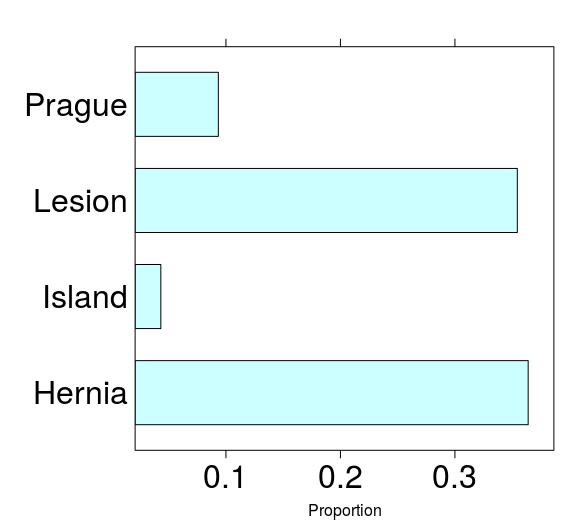

## Aims of EndoMineR

The goal of EndoMineR is to extract as much information as possible from endoscopy reports and their associated pathology specimens. 

Gastroenterology now has many standards against which practice is measured although many reporting systems do not include the reporting capability to give anything more than basic analysis. Much of the data is locked in semi-structured text. However the nature of semi-structured text means that data can be extracted in a standardised way- it just requires more manipulation. This package provides that manipulation so that complex endoscopic-pathological analyses, in line with recognised standards for these analyses, can be done.


##How is the package divided?


{width=900px}

The package is basically in three parts. How all the functions are connected in Figure 2. Extracts from this figure will be used in sequential sections below.

1. **The extraction**- This is really when the data is provided as full text reports. You may already have the data in a spreadsheet in which case this part isn't necessary

2. **Cleaning**- These are a group of functions that allow the user to extract and clean data commonly found in endoscopic and pathology reports. The cleaning functions usually remove common typos or extraneous information and do some reformatting

3. **Analyses**- The analyses provide graphing function as well as analyses according to the cornerstone questions in gastroenterology- namely surveillance, patient tracking, quality of endoscopy and pathology reporting and diagnostic yield questions.


## The extractor function

Endoscopic and pathological data will come in one of two forms- either as a collection of the whole text report or as spreadsheets with some degree of separation into different columns of the various aspects of that report eg who the Endoscopist was, the patient's unique identifier etc.
For the latter, the package user will not need to Extract information as it is already extracted and so can go straight to cleaning the data. For the former the Extractor function has been provided:

<br>


<br>

One of the most useful functions in the package is the Extractor. Different hospitals will use different software with different headings for endoscopic reports. The extractor allows the user to define the separations in a report so that all reports can be automatically placed into a meaningful dataframe for further cleaning. This is analogous to tokenization in natural language processing. Here we use the in built datasets as part of the package. Prior to tokenization it is recommended to use the ChopperNewLine function to divide the free text up by sentence (this can be useful if not using multiline regex or you have another way of splitting the text rather than using the Extractor)

```{r exampleChopperNewLines, eval = FALSE}
v<-ChopperNewLines(Myendo,'OGDReportWhole')
```

<br>

A list of keywords is then constructed. This list is made up of the words that will be used to split the document. The Extractor then does the splitting for each pair of words, with some cleaning up and then returns the split dataframe:

```{r exampleExtractor, eval = FALSE}
Mypath<-data(PathDataFrameFinalColon)
HistolTree<-list("Hospital Number","Patient Name","DOB:","General Practitioner:",
"Date of procedure:","Clinical Details:","Macroscopic description:","Histology:","Diagnosis:","")
for(i in 1:(length(HistolTree)-1)) {
Mypath<-Extractor(Mypath,"PathReportWhole",as.character(HistolTree[i]),
as.character(HistolTree[i+1]),as.character(HistolTree[i]))
}
```


## The cleaning functions

### Endoscopic cleaning

Once the extraction has been done there are various cleaning functions provided based around the extraction of likely columns. For example if the Endoscopist name has been pulled out, the EndoscChopperEndoscopist function can be used which returns the submitted data frame with the Endoscopist column cleaned up
```{r exampleEndoscChopperEndoscopist, eval = FALSE}
EndoscChopperEndoscopist(Myendo,'Endoscopist')
```

This function performs the cleaning of common things found in the text that may cause confusion. The function itself is shown below:

```{r exampleEndoscChopperEndoscopistWhole, eval = FALSE}
EndoscChopperEndoscopist <- function(x, y) {
    # Extraction of the Endoscopist
    x <- data.frame(x)
    x[, y] <- gsub("Dr", "", x[, y], fixed = TRUE)
    x[, y] <- gsub("Mr", "", x[, y], fixed = TRUE)
    x[, y] <- gsub("[^[:alnum:],]", "", x[, y])
    # Put gaps between names
    x[, y] <- gsub("([a-z])([A-Z])", "\\1 \\2", x[, y])
    x[, y] <- gsub("2nd.*", "", x[, y])
    x[, y] <- trimws(x[, y], which = c("both"))
    
    return(x)
}

```


<br>


<br>

The EndoscChopperMeds currently extracts Fentanyl and Midazolam doses into a separate column and reformats them as numeric columns so further calculations can be done. In future iterations pethidine, propofol and general anaesthetic will also be able to be extracted. 

Several other similar clean up functions are available for Endoscopy as follows:
```{r exampleEndoCleaningFunc, eval = FALSE}
v<-EndoscChopperMeds(Myendo,'Medications')
v<-EndoscChopperInstrument(Myendo,'Instrument')
v<-EndoscChopperIndications(Myendo,'Indications')
v<-EndoscChopperProcPerformed(Myendo,'ProcedurePerformed')
```

Future iterations will try to make these cleaning functions more generic and applicable to a wider number of use cases

### Histological cleaning

The cleaning functions for histology are a little more difficult as Histology reports often have a greater degree of free text reporting.
In general, each histology reports can be divided into the Macroscopic description of a specimen which itself is comprised of how many specimens there are for each sample sent (a sample can be a pot which includes several specimens) and how big each specimen is. The report will often give a detailed description of what is actually seen and then provide an overall diagnosis.

<br>


<br>


The histology cleaning functions are based around this. For example, the HistolChopperHistol cleans the Histology text if present. In addition it removes Negative diagnoses using the Negativeremove function. This function is designed to remove all sentences that give negative diagnoses (eg "There is no evidence of...") so that false positive diagnoses are not made during the analysis stage.

This NegativeRemove function has also been applied to the HistolChopperDx

```{r exampleEHistolChopperHistol, eval = FALSE}
t<-HistolChopperHistol(Mypath,'Histology')
```

Because the information from the Macroscopic Description is based around numbers, a further function has been provided to extract numbers from the text. This function is usually only used as part of HistolChopperNumOfBx which extracts the number of biopsies taken:

```{r exampleHistolChopperMacDescrip, eval = FALSE}
HistolChopperNumbOfBx <- function(x, y, z) {
    x <- data.frame(x)
    x <- HistolChopperMacDescrip(x, y)
    mylist <- str_match_all(x[, y], paste("[0-9]{1,2}.{0,3}", z, sep = ""))
    x$NumbOfBx <- sapply(mylist, function(p) sum(as.numeric(gsub(z, "", p))))
    return(x)
}
```

In order to extract the numbers, the limit of what has to be extracted has to be set as part of the regex so that the function takes whatever word limits the selection.It collects everything from the regex [0-9]{1,2}.{0,3} to whatever the string boundary is.

```{r exampleHistolChopperNumbOfBx, eval = FALSE}
v<-HistolChopperNumbOfBx(Mypath,'Macroscopicdescription','specimen')
```

Other less useful functions include:

1. HistolChopperAccessionNumber which extracts Accession Number  data from the report where one is present.The Accession number relates to the actual specimen number as ascribed by the pathology service.

2. HistolChopperExtrapolDx which extracts other specific diagnoses from the report. These have been hard coded to 
look for dysplasia cancer and GIST. 

3. HistolChopperMacDescripCleanup. This extracts Macroscopic description data from the pathology report.Macroscopic description usually relates to the number of specimens retrieved, the size of each specimen and the location it was taken from. The cleanup usually relates to the removal of top and tail characters such as who reported the specimens etc. 

These are all called in the same way:

```{r exampleOtherFunctionsHistology, eval = FALSE}
v<-HistolChopperMacDescripCleanup(Mypath,"Macroscopicdescription")
v<-HistolChopperExtrapolDx(Mypath,"Diagnosis")
v<-HistolChopperAccessionNumber(Mypath,"Histology","SP-\\d{2}-\\d{7}")
```
v<-HistolChopperMacDescripCleanup(Mypath,"Macroscopicdescription")

<br>
<br>

## The Analysis Functions

As per the introduction the analysis functions are split according to the cornerstone questions in day to day gastroenterological practice

###Surveillance functions

Surveillance relates to the timing of a test relative to other tests or all tests done for a patient. As such the functions for surveillance extract the date the first test was done, as well as the last test and the difference in timing between each test, always grouped by patient. As all these functions are simply looking at the date of the test they can take a raw dataset, as long as a date column is present and use that, rather than have a load of pre-processing steps

<br>


<br>

```{r exampleSurveillanceTimeByRow, eval = FALSE}
em<-SurveillanceTimeByRow(Myendo,'HospitalNumber','Dateofprocedure')
em<-SurveillanceLastToNow(Myendo,'HospitalNumber','Dateofprocedure')
em<-SurveillanceLastTest(Myendo,'HospitalNumber','Dateofprocedure')
em<-SurveillanceFirstTest(Myendo,'HospitalNumber','Dateofprocedure')
```

Of course we also want to know how many tests have been done over a time period and this is provided by two functions

```{r exampleSurveillanceCapacity, eval = FALSE}
em<-SurveillanceCapacity(Myendo,"Dateofprocedure)
```


This function will return the number of tests by month. The more detailed function is:

```{r exampleHowManyTests, eval = FALSE}
how<-HowManyTests(Myendo,'Indications','Dateofprocedure','Surv')
```


This will provide the number of tests by month and year as a table as well as a ggplot. It returns aa list so this can be accessed with how[1] and how[2]

###Patient flow functions

We often like to get an overview of how patients are flowing through a system overall. This can give a nice visual representation of whether which patients diverge from the normal flow through a system so we can study them further. There are two ways to look at this. Sankey plots give good timepoint by timepoint representation of flow. This really works with more than one type of event at each timepoint. 
For example, if we have a dataset with events such as 'radiofrequency ablation' and 'endoscopic mucosal resection' or 'nothing' we can use the Sankey plot to determine the order of events over a large patient population:


```{r exampleSurveySankey, eval = FALSE}
how<-SurveySankey(Myendo,"ProcPerformed")
```

<br>

{width=600px}

<br>

We may was something even more aggregated. Perhaps we want to see the overall number of patients that go from one event to another regardless of which timepoint it is at. To do this we can use a circos plot, which makes use of the circlize library, as follows:

```{r examplePatientFlow_CircosPlots, eval = FALSE}
flow<-PatientFlow_CircosPlots(v,"Dateofprocedure","HospitalNumber","ProcedurePerformed")
```

<br>

{width=600px}

<br>

###Assessment of quality functions

Quality is measured in a variety of different ways. For endoscopy it is measured according to the adherence to standards for endoscopic documentation as well as detection of certain pathological conditions such as dysplasia.


####Documentation Quality
As regards adherence to documentation for example, a generic function is provided that will look up the presence of words presented in a list in a target column. It will then output the proportion of reports that have these words, as well as a barchart to show what proportion of the endoscopies showed these words. The list can be comprised on terms that should be mentioned in a report.

```{r exampleListLookup, eval = FALSE}
tt<-ListLookup(Myendo,'Findings',myNotableWords)
```

####Endoscopic Quality
Another measure of quality is by looking at those factors that are recorded at endoscopy such as degree of sedation used etc. Rather than provide a function for each metric, again a generic function is provided that uses any quantifiable metric and plots it against the endoscopist. This function returns a list with two elements- the plot and the table

```{r exampleEndoscChopperMeds, eval = FALSE}
Myendo<-EndoscChopperMeds(Myendo,'Medications')
MetricByEndoscopist(Myendo,'Endoscopist','Fent')
```

<br>

{width=600px}

<br>

Although not strictly a measure of endoscopic quality, the location of polyps (as well as any sample location) can also be determined. This is particularly for lower GI endoscopy and can help determine whether, for example, the number of right sided polyps is lower than it should be for certain endoscopists.

To do this firstly the free text needs to be standardised. This is provided through the function TermStandardLocation which provides a standard correction for a number of typos and alternative spellings.

```{r exampleTermStandardLocation, eval = FALSE}
f<-TermStandardLocation(Mypath,'Histology')
```

Once this is done, a column called SampleLocation is appended to the existing dataset. If polyps need to be located then the PolypLocator function can be used. Alternatively the SampleLocator can be used. As they append differently named columns to the existing dataset, both can be used together. The polyps text often need a bit of tidying up and this can be done with the function PolypTidyUpLocator prior to using PolypLocator

```{r examplePolypTidyUpLocator, eval = FALSE}

f<-PolypTidyUpLocator(f,'SampleLocation')
f<-PolypLocator(f,'SampleLocation') 
f<-SampleLocator(f,'SampleLocation')
```


A further difficult area is the assessment of endoscopic quality by looking at the pathology processed from an endoscopy. This package is excellent at dealing with this kind of question because of its ability to merge the datasets together:

A particularly well developed area to look at is that of the Global Rating Scale for assessing the quality of colonoscopy. One of the metrics- the adenoma detection rate assesses the number of colonoscopies where at least one adenoma was detected.

One function is provided to produce a table that gives the number of adenomas, adenocarcinomas and hyperplastic polyps (also as a ration to adenomas) by endoscopist therefore immediately fulfilling the GRS reqquirement for the ADR as well as provding further metrics alongside

```{r exampleGRS_Type_Assess_By_Unit, eval = FALSE}
GRSTable<-GRS_Type_Assess_By_Unit(v,'ProcedurePerformed','Endoscopist','Diagnosis','Histology')
```


###Basic surveillance questions- who is undergoing endoscopic surveillance and who should we be surveying?


####Enrollment rates to surveillance programme

So now this has been determined we can continue to some more advanced analyses. We can determine how many patients who underwent endoscopy for reasons that was not Barrett's surveillance, and in whom Barrett's oesophagus was found, have had further follow-up endoscopies ie what the enrollment to surveillance rate is in those who weren't known to have Barrett's when their endoscopy was performed.

This function graphs the patients who were not on surveillance programmes and sees how many then had an endoscopy. This should be run after the BarrettsDataAccord_Prague and BarrettsDataAccord_PathStage.

```{r exampleBarrettsPatientTracking_Enrollment_Surveillance, eval = FALSE}
Enroll<-BarrettsPatientTracking_Enrollment_Surveillance(Myendo,'HospitalNumber','Dateofprocedure','Indications')
```


####Patients undergoing surveillance

Perhaps we are also interested in how many patients fall under each follow-up category so we can plan how many Barrett's surveillance endoscopies we are going to have to do. The function to do this gets the unique patient ID's for each patient, for each rule. It lists the unique PatientIDs assocaited with a rule ('Rule1','Rule2','Rule3','NoRules'). This allows us to determine how many patients will need follow up at specific time intervals. This should be run after the BarrettsDataAccord_Prague and BarrettsDataAccord_PathStage.

```{r exampleBarrettsPatientTracking_UniqueHospNum, eval = FALSE}
v<-Endomerge2(Myendo,"Dateofprocedure","HospitalNumber",v,"Dateofprocedure","HospitalNumber")
b1<-BarrettsDataAccord_Prague(v,'Findings')
b2<-BarrettsDataAccord_PathStage(b1,'Histology')
b3<-BarrettsDataAccord_Event(b2,'Histology','ProcedurePerformed','OGDReportWhole','Findings')
b4<-BarrettsDataAccord_FUGroup(b3,'Findings')
colnames(b4)[colnames(b4) == 'pHospitalNum'] <- 'HospitalNumber'
Rule<-BarrettsPatientTracking_UniqueHospNum(b4,'Rule1','HospitalNumber')
```

###Quality assessment in Barrett's surveillance

####Quality of documentation for Barrett's surveillance endoscopies

As we have done above, we can also assess the documentation used in Barrett's endoscopies. There are standards associated with the endoscopies that all endoscopists should adhere to. This function therefore assesses the Barrett's documentation. This notes how many reports contain the mandatory report fields as specified in the BSG standards on  Barrett's endoscopic reporting. This should be run after the BarrettsDataAccord_Prague as assessment of the Prague score is a part of this assessment:

```{r exampleBarrettsQuality_AnalysisDocumentation, eval = FALSE}
v<-Endomerge2(Myendo,"Dateofprocedure","HospitalNumber",v,"Dateofprocedure","HospitalNumber")
b<-BarrettsDataAccord_PathStage(v,'Histology')
BarrettsQuality_AnalysisDocumentation(b,"Findings")
```


<br>

{width=600px}

<br>

####Quality of perfomance of Barrett's surveillance endoscopies as just by tissue sampling

One of the essential requirements to demonstrate adequate sampling of Barrett's oesophagus during endoscopy is that the endoscopist should adhere to the 'Seattle protocol' for biopsies which is to take  4 equally spaced biopsies at 2cm intervals in the circumferential part of the oesophagus. Because the macroscopic description of the pathological specimen tells us how many samples are taken overall (and rarely how many at each level but this is usually not the case for a variety of reasons) we can determine the shortfall in the number of biopsies taken, per endoscopist. Again pre-processing the Barrett's samples is pre-requisite.

```{r exampleBarrettsQuality_AnalysisBiopsyNumber, eval = FALSE}
# Firstly relevant columns are extrapolated from the
 # Mypath demo dataset. These functions are all part of Histology data
 # cleaning as part of the package.
 v<-HistolChopperDx(Mypath,'Diagnosis')
 v<-HistolChopperExtrapolDx(v,'Diagnosis')
 v<-HistolChopperNumbOfBx(v,'Macroscopicdescription','specimen')
 v<-HistolChopperBxSize(v,'Macroscopicdescription')
 # The histology is then merged with the Endoscopy dataset. The merge occurs
 # according to date and Hospital number
 v<-Endomerge2(Myendo,'Dateofprocedure','HospitalNumber',v,'Dateofprocedure',
 'HospitalNumber')
 # The function relies on the other Barrett's functions being run as well:
 b1<-BarrettsDataAccord_Prague(v,'Findings')
 b2<-BarrettsDataAccord_PathStage(b1,'Histology')
 b3<-BarrettsDataAccord_Event(b2,'Histology',
 'ProcedurePerformed','OGDReportWhole','Findings')
 # The follow-up group depends on the histology and the Prague score for a
 # patient so it takes the processed Barrett's data and then looks in the
# Findings column for permutations of the Prague score.
 b4<-BarrettsDataAccord_FUGroup(b3,'Findings')
 colnames(b4)[colnames(b4) == 'pHospitalNum'] <- 'HospitalNumber'
 # The number of average number of biopsies is then calculated and
 # compared to the average Prague C score so that those who are taking
 # too few biopsies can be determined
 BarrettsQuality_AnalysisBiopsyNumber(b4,'Date.x','HospitalNumber',
                                      'Endoscopist')
```
 <br>
 
 {width=600px}
 
 <br>
 
 
 <br>
 
 This function will again return a list with a ggplot showing the shortfall per endoscopist as well as a table with the same values

####Quality of perfomance of Barrett's surveillance endoscopies

As we discovered with some of the generic functions above, one way to determine quality of endoscopy is to assess the pathology of specimens taken at surveillance per year. This function outputs a plot which determines the the overall number of pathologies (low/high grade dysplasia and cancer) for patients on surveillance.

```{r exampleBarrettsSurveillance_PathDetection, eval = FALSE}
Endomerge2(Myendo,"Dateofprocedure","HospitalNumber",v,"Dateofprocedure","HospitalNumber")
b1<-BarrettsDataAccord_Prague(v,'Findings')
b2<-BarrettsDataAccord_PathStage(b1,'Histology')
b3<-BarrettsDataAccord_Event(b2,'Histology','ProcedurePerformed','OGDReportWhole','Findings')
b4<-BarrettsDataAccord_FUGroup(b3,'Findings')
colnames(b4)[colnames(b4) == 'pHospitalNum'] <- 'HospitalNumber'
BarrettsSurveillance_PathDetection(b4,'Myplot')
```
 
<br>
  
 {width=600px}
 
<br>
 
 This function provides a plot with absolute numbers of pathology detected. This of course doesn't tell us the per endoscopist rate so a further function is provided which looks specifically at the detection of dysplasia by endoscopist as a function of the number of surveillance endoscopies done by that endoscopist. The output is provided as a table of proportions per endoscopist

```{r exampleBarrettsSurveillanceDDR, eval = FALSE} 
 v<-Endomerge2(Myendo,"Dateofprocedure","HospitalNumber",v,"Dateofprocedure","HospitalNumber")
b1<-BarrettsDataAccord_Prague(v,'Findings')
b2<-BarrettsDataAccord_PathStage(b1,'Histology')
b3<-BarrettsDataAccord_Event(b2,'Histology','ProcedurePerformed','OGDReportWhole','Findings')
b4<-BarrettsDataAccord_FUGroup(b3,'Findings')
colnames(b4)[colnames(b4) == 'pHospitalNum'] <- 'HospitalNumber'
BarrettsSurveillanceDDR(b4,'Endoscopist','IMorNoIM')
``` 

### Assessment of Barrett's therapeutics

Barrett's patients also undergo therapeutic procedures and there are various metrics to analyse the performance of the therapy by endoscopist, as well which catheters are being used etc. To start with we can do simple things like plotting all the pathological grades of the EMRs.This should only be run after all the BarrettsDataAccord functions so that the column event is present in the dataframe.


The therapeutic functions are fairly self-explanatory. The function to determine the post EMR grade is BarrettsTherapy_Numbers_EMRsByGrade with correlation with the endoscopists Paris classification provided for with the function:
 
```{r exampleBarretts_LesionRecognitionEMR, eval = FALSE} 
Barretts_LesionRecognitionEMR(dataframe,y,z)
``` 

<br>

 {width=600px}

<br>

 In order to determine the basic number of EMR, RFA and APC a function called BarrettsBasicNumbers is provided which outputs a geom_line plot with the information on it.
 
```{r exampleBarrettsBasicNumbers, eval = FALSE} 
BarrettsBasicNumbers(dataframe)
``` 
 
 <br>

{width=600px}

<br>


 To assess the number of different catheter types used (for renumeration purposes) the following function can be used:
 
```{r exampleBarrettsTherapeuticsRFA_ByCatheter, eval = FALSE} 
BarrettsTherapeuticsRFA_ByCatheter(dataframe)
``` 

<br>

{width=600px}

<br>

One of the most important aspects of therapeutics is the assessment of outcome which is defined as clearance of intestinal metaplasia (CRIM), usually on at least two endoscopies. As most patients undergoing Barrett's ablation will require radiofrequency ablation after the initial endoscopic mucosal resection, we can define CRIM as being an endoscopy where the therapeutic procedure is listed as 'nothing' in the EVENT column (this will only work if the Barrett's pre-processing functions have been used)

```{r exampleBarrettsCRIM, eval = FALSE} 
BarrettsCRIM(dataframe,HospNum,EVENT)
``` 